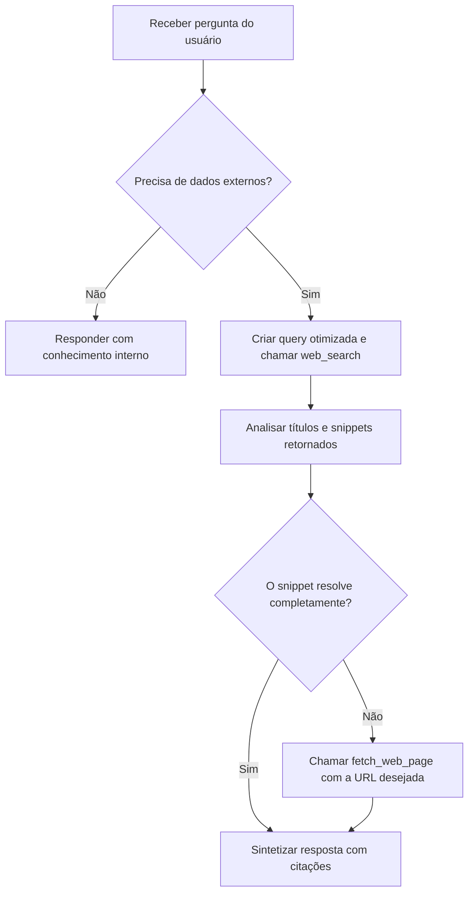

# Skill de Busca na Internet para LLMs Locais

Esta habilidade (skill) capacita os modelos de linguagem locais (como Ollama, LM Studio, DeepSeek, Llama 3, Qwen, Mistral) a realizarem pesquisas eficazes na internet e lerem o conteúdo de páginas web.

---

## 🎯 Quando Usar a Busca na Web

Ative esta habilidade quando a solicitação do usuário se enquadrar em qualquer um dos cenários abaixo:
- **Informações Recentes ou em Tempo Real**: Notícias, cotações de moedas, clima, eventos recentes, esportes e tendências atuais.
- **Verificação de Fatos e Dados Técnicos**: Confirmação de estatísticas, nomes, datas, locais e especificações técnicas.
- **Documentações e Bibliotecas de Software**: Atualizações de código, novidades de linguagens de programação, novas versões de APIs e pacotes.
- **Leitura de Conteúdo de URLs**: Quando o usuário fornece um link de site e pede para resumir, traduzir ou analisar seu conteúdo.

---

## 🛠️ Ferramentas Disponíveis

### 1. `web_search`
- **Descrição**: Realiza uma pesquisa geral na internet e retorna os 5 principais resultados contendo Título, URL e Snippet (resumo).
- **Parâmetros**:
  - `query` (obrigatório, string): Termos de busca otimizados (ex: `"cotação dólar hoje"`, `"python 3.12 novidades"`).
  - `max_results` (opcional, inteiro): Quantidade de resultados desejados (padrão: 5).

### 2. `fetch_web_page`
- **Descrição**: Faz o download e extrai o texto limpo de uma página específica quando o snippet da busca não tiver detalhes suficientes.
- **Parâmetros**:
  - `url` (obrigatório, string): URL completa do site (ex: `"https://pt.wikipedia.org/wiki/Python"`).
  - `max_chars` (opcional, inteiro): Limite de caracteres do texto retornado (padrão: 4000).

---

## 💡 Como Otimizar as Consultas de Busca

1. **Seja Objetivo**: Remova palavras de preenchimento desnecessárias.
   - ❌ *Erro*: `"você pode me dizer por favor qual é o preço do bitcoin hoje no brasil?"`
   - ✅ *Correto*: `"preço bitcoin hoje BRL"`

2. **Idioma da Busca**: Pesquise no idioma mais provável de conter a resposta. Para programação ou tecnologia internacional, termos em inglês funcionam melhor.

3. **Refinamento**: Se a primeira busca retornar resultados irrelevantes, reformule os termos usando sinônimos ou adicione o ano/contexto (ex: `"ollama tool calling 2026"`).

---

## 📑 Fluxo de Trabalho Recomendado para a LLM



---

## 📝 Regras de Sintetização e Resposta

1. **Citação Obrigatória de Fontes**: Sempre inclua os links das fontes consultadas no final ou ao longo da resposta no formato Markdown:
   - Exemplo: `De acordo com as informações obtidas no [Portal G1](https://g1.globo.com)...`
2. **Fidelidade aos Dados**: Baseie suas afirmações estritamente nos resultados retornados. Não invente URLs ou fatos que não constem na busca.
3. **Transparência**: Se a busca não retornar resultados conclusivos, informe ao usuário de maneira clara e transparente o que foi pesquisado e peça esclarecimentos se necessário.

---

## 📋 Exemplos Práticos de Chamada

### Exemplo 1: Busca Básica
**Usuário**: "Quais as novidades do Python 3.12?"
**Ação da LLM**:
```json
{
  "name": "web_search",
  "parameters": {
    "query": "Python 3.12 novidades recursos"
  }
}
```

### Exemplo 2: Aprofundamento em URL
**Usuário**: "Resuma a página https://exemplo.com/artigo-ia"
**Ação da LLM**:
```json
{
  "name": "fetch_web_page",
  "parameters": {
    "url": "https://exemplo.com/artigo-ia",
    "max_chars": 3000
  }
}
```
